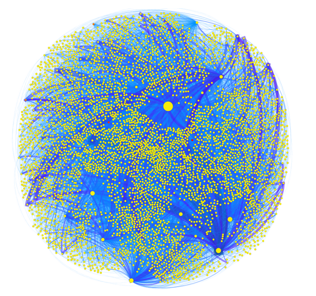
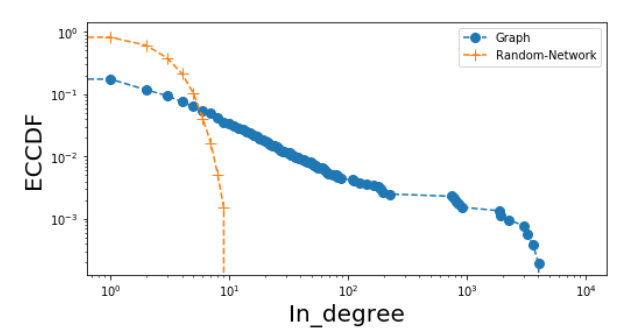
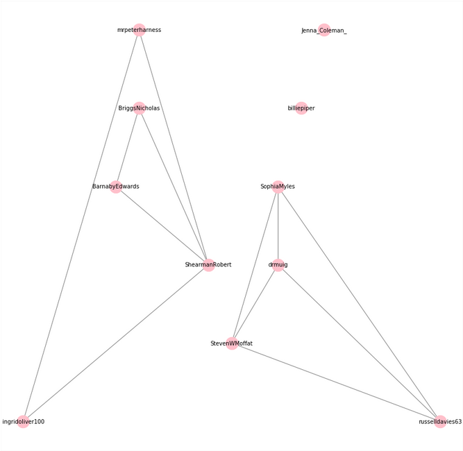
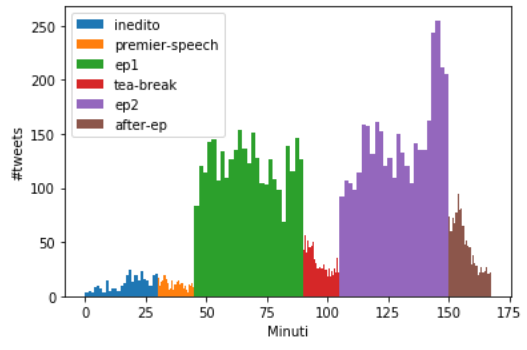

## Doctor Who: Lockdown! - Analysis

[Doctor Who: Lockdown!](https://tardis.fandom.com/wiki/Doctor_Who:_Lockdown!) è stato un progetto fondato da Emily Cook della rivista <em>Doctor Who Magazine</em> che ha proposto ai fan di Doctor Who l'idea di fare un rewatch mondiale di alcuni episodi della serie per passare il tempo in auto-isolamento a causa dell'emergenza COVID-19. I rewatch coinvolgevano membri del cast e della produzione della serie che commentavano gli episodi, insieme ai fan, su twitter. Gli eventi prevedevano, a volte, il rilascio di contenuti inediti aggiuntivi pre/post episodio.  

L'idea alla base di questo progetto è quella di analizzare le interazioni avvenute durante i live-tweetting attraverso la rete delle menzioni. Le principali domande di ricerca a cui abbiamo risposto sono le seguenti:
- Quali sono gli utenti più menzionati? Quali gli utenti più espansivi? Ci sono influencer che non fanno parte del cast o della produzione della serie?
- Disponendo gli episodi in ordine d’uscita temporale, è possibile osservare un partizionamento in community simile tra il grafo di un episodio e il grafo dell’episodio successivo?
- È possibile identificare sensatamente il momento saliente di un episodio osservando il numero di interazioni al minuto lungo lo streaming?

Disclaimer: This post is a brief project overview for everyone. If you are interested in implementation details please view the project on [github](https://github.com/manuel-dileo/dwlockdown-analysis).  
NB: Questo post è un piccolo articolo di presentazione del progetto adatto alla lettura di tutti. Se sei interessato ai dettagli implementativi del lavoro consulta la [repo](https://github.com/manuel-dileo/dwlockdown-analysis) del progetto.

### Acquisizione Dati

Utilizzando l'endpoint [filtered stream v1](https://developer.twitter.com/en/docs/labs-v1/filtered-stream/overview) delle twitter streaming API, abbiamo acquisito, in tempo reale, per alcuni degli episodi ritrasmessi, i tweet che contengono menzioni e l’hashtag di riferimento, oppure menzionano gli account ufficiali o un membro del cast/crew coinvolto.  

Gli episodi per cui abbiamo raccolto dati sono i seguenti:
- <em> Dalek </em>, stagione 1, episodio 6.
- <em> The Girl in the Fireplace </em>, stagione 2, episodio 4.
- <em> The Zygon Invasion - The Zygon Inversion </em>, stagione 9, episodi 7-8.
- <em> Listen </em>, stagione 8, episodio 4.  

Per facilitare ed automatizzare il lavoro, abbiamo estratto dalle pagine della [Doctor Who Wiki](https://tardis.fandom.com/wiki/Doctor_Who_Wiki), i titoli degli episodi ritrasmessi, gli hashtag di riferimento e i nomi delle persone coinvolte, distinguendole tra membri della produzione e del cast.  

Utilizzando i tweet raccolti, abbiamo costruito un grafo delle menzioni. Il grafo è orientato e pesato. 
I nodi del grafo sono gli utenti, identificati dall’id twitter, ed esiste un arco dal nodo i al nodo j di peso w se i ha menzionato j un numero w di volte.  

Illustriamo di seguito una possibile visualizzazione della rete ottenuta.

I nodi variano di dimensione a seconda di quanto sono influenti nella rete: i nodi più grandi sono i nodi che hanno ricevuto più menzioni, ovvero gli influencer della rete. I nodi variano di colore a seconda di quanto sono espansivi nella rete: i nodi verso i colori più rossi sono i nodi più attivi, ovvero quelli che eseguono più menzioni, nella rete. Gli archi variano di colore a seconda del loro peso: più un arco è scuro maggiore è l'interazione fra i due utenti coinvolti nell'arco.

### Proprietà fondamentali della rete

La rete possiede 5208 nodi e 16520 link e rispecchia le caratteristiche tipiche di una rete estratta da un social network.  

Essa possiede una densità sull'ordine di 10-4 e le distribuzioni dell'out-degree e dell'in-degree dei nodi seguono una power-law. Illustriamo di seguito l'andamento della ECCDF dell'in-degree della nostra rete, a confronto con l'in-degree di una random network G(5208,densità), su una scala log-log.

La rete non è debolmente connessa ma esiste una giant component, a cui appartiene circa il 90% dei nodi, che ha diametro pari a otto. Il coefficiente di clustering locale mediato sull'intera rete, calcolato escludendo i nodi con coefficente pari a zero, è pari a 0.67 e la reciprocità delle menzioni è molto bassa.

### Analisi degli influencer

Presentiamo nelle tabelle seguenti gli utenti più influenti e più espansivi nella rete affiancati dai rispettivi valori di in/out degree e per gli indici di centralità più noti.
<table border="1" class="dataframe">
  <thead>
    <tr style="text-align: right;">
      <th>user (influencer)</th>
      <th>in_degree</th>
      <th>in_degree_centrality</th>
      <th>out_degree</th>
      <th>out_degree_centrality</th>
      <th>pagerank</th>
    </tr>
  </thead>
  <tbody>
    <tr>
      <th>StevenWMoffat</th>
      <td>9535</td>
      <td>0.40</td>
      <td>25</td>
      <td>0.001</td>
      <td>0.18</td>
    </tr>
    <tr>
      <th>Emily_Rosina</th>
      <td>3209</td>
      <td>0.22</td>
      <td>62</td>
      <td>0.005</td>
      <td>0.04</td>
    </tr>
    <tr>
      <th>russelldavies63</th>
      <td>3600</td>
      <td>0.20</td>
      <td>31</td>
      <td>0.001</td>
      <td>0.11</td>
    </tr>
    <tr>
      <th>SophiaMyles</th>
      <td>3031</td>
      <td>0.20</td>
      <td>30</td>
      <td>0.004</td>
      <td>0.06</td>
    </tr>
    <tr>
      <th>mrpeterharness</th>
      <td>4022</td>
      <td>0.12</td>
      <td>17</td>
      <td>0.001</td>
      <td>0.03</td>
    </tr>
    <tr>
      <th>ShearmanRobert</th>
      <td>2271</td>
      <td>0.12</td>
      <td>17</td>
      <td>0.003</td>
      <td>0.03</td>
    </tr>
  </tbody>
</table>
<table border="1" class="dataframe">
  <thead>
    <tr style="text-align: right;">
      <th>user (authority)</th>
      <th>out_degree</th>
    </tr>
  </thead>
  <tbody>
    <tr>
      <th>BlogtorWho</th>
      <td>861</td>
    </tr>
    <tr>
      <th>DrWho247</th>
      <td>646</td>
    </tr>
    <tr>
      <th>DoctorWhoPN</th>
      <td>538</td>
    </tr>
    <tr>
      <th>TomFrosttt</th>
      <td>405</td>
    </tr>
    <tr>
      <th>AH96DWfan</th>
      <td>398</td>
    </tr>
    <tr>
      <th>Wishing4aTARDIS</th>
      <td>393</td>
    </tr>
  </tbody>
</table>
La maggior parte degli influencer sono gli scrittori o gli showrunner degli episodi di cui ho raccolto i dati.  
Sophia Myles è una delle attrici protagoniste dell’episodio di cui ho raccolto più tweet. L’utente Emily_Rosina non fa parte né del cast né dei produttori della serie ma è un influencer della rete in quanto giornalista del DW Magazine e organizzatrice del progetto.  
Gli utenti più espansivi sono account mono tematici oppure legati a piattaforme fan-made sulla serie che cercano di espandersi il più possibile nella rete in cerca di nuovi followers.  
Non c’è correlazione tra l’in-degree e l’out-degree, ovvero gli utenti influencer non sono anche quelli più espansivi.  

Al fine di analizzare quanto i membri del cast e della produzione interagiscono tra di loro, abbiamo estratto la sottorete delle menzioni tra essi. Mi aspetto che tale sottorete sia densa, ovvero con molte interazioni fra gli utenti, e transitiva, cioè con utenti terzi spinti dalla voglia di partecipare ad una discussione tra altri due utenti. Presentiamo di seguito la sottorete ottenuta.

Billie Piper e Jenna Coleman, pur essendo due protagoniste assolute della serie e degli episodi visti, non sono mai state coinvolte nelle maratone su twitter, dunque è sensato non abbiano mai interagito. Si formano inoltre due componenti connesse: una legata agli episodi scritti da Moffat(the Girl in the Fireplace, Listen), dove Russell T Davies, pur non essendo lo scrittore dell'episodio, ha deciso di partecipare, e una legata alla trasmissione dei rimanenti episodi.  
La componente connessa legata a Moffat è un grafo completo. Questo avviene perché, se si è coinvolti in un rewatch come ospiti, gli utenti si aspettano non solo la partecipazione dei singoli ma anche l'interazione tra essi. Ciò porta a un'elevata pressione per i membri del cast a menzionarsi fra loro, che si aggiunge a quella portata dalla forza che lega più probabilmente due utenti che hanno una relazione in comune. La presenza di Russell T Davies, pur non essendo direttamente coinvolto nella visione dei due episodi, con legami con tutti gli utenti nella rete, segna il suo profondo amore verso la serie di cui, in un punto fondamentale della storia della serializzazione, è stato showrunner.  
La componente connessa legata ai restanti episodi ha alta transitività ma non è un grafo completo. Per quanto detto sopra, potremmo interpretare le mancate chiusure delle triadi come volontà da parte di due utenti di non voler stringere un legame. Più in generale, gli utenti che sono coinvolti in triadi aperte potrebbero avere un grado di affetto minore verso la serie.

### Community Detection

Lo scopo di questa parte di analisi è capire quanto il partizionamento in community dei grafi di episodi vicini è simile. Un alto grado di similarità tra due partizionamenti in community comporta una similarità tra le interazioni degli utenti coinvolti nel rewatch. Si potrebbe evidenziare, ad esempio, una similarità tra gli episodi dell'era RTD o dell'era Moffat e una dissimilarità tra due episodi appartenenti a ere diverse.  

Per valutare la similarità tra due partizionamenti abbiamo utilizzato la [normalized mutual information](https://scikit-learn.org/stable/modules/generated/sklearn.metrics.normalized_mutual_info_score.html). Tale metrica è in grado di valutare la similarità di due partizionamenti dello stesso insieme, pertanto abbiamo dovuto estrarre un sottoinsieme di utenti di riferimento comune a tutti gli episodi, ovvero gli utenti che hanno partecipato attivamente a tutti e quattro gli eventi (core degli utenti). Il core degli utenti è composto da quasi 200 utenti. Emily Rosina è l'unica influencer che appartiene al core mentre è presente la quasi totalità degli utenti espansivi.  

Abbiamo disposto gli episodi in ordine cronologico e valutato la similarità tra episodi vicini utilizzando alcuni algoritmi di community detection (louvain, label propagation), senza mai evidenziare un valore alto di similarità.

### Analisi delle interazioni e highlights

Abbiamo infine analizzato il numero di interazioni al minuto lungo il corso della durata degli eventi. Riportiamo di seguito l'analisi delle interazioni dell'evento più interessante, ovvero quello riguardante la ritrasmissione del doppio episodio sugli Zygon. L'evento aveva la seguente scaletta:
- Ore 18.30(BST): Pubblicazione contenuto inedito.
- Ore 19.00-19.15: Discorso del premier Boris Johnson su BBC One.
- Ore 19.15-20.00: Trasmissione episodio 1.
- Ore 20.00-20.15: Tea break.
- Ore 21.15: Trasmissione episodio 2.

Osserviamo l'istogramma del numero delle interazioni lungo il corso dell'evento considerando intervalli di ampiezza pari a un minuto e mezzo.

Con una rapida occhiata è facile notare che il numero di interazioni ha un andamento ragionevole lungo il corso dell'evento: esso è basso fino alla trasmissione del primo episodio, raggiunge dei buoni picchi durante <em> The Zygon Invasion </em>, torna ad essere basso durante la pausa, raggiunge i picchi più alti verso il finale di <em> The Zygon Inversion </em> e torna a diminuire dopo i titoli di coda.  
Le informazioni fornite dall'istogramma ci permettono di provare a costruire un estrattore automatico di highlights degli eventi. Se consideriamo un intervallo ampio 4 minuti e mezzo con centro nella moda dell'istogramma e ritardo di un minuto tra tempo di pubblicazione dei tweet, ovvero quello riportato nell'istogramma, e minutaggio effettivo dell'episodio, otteniamo un buon riconoscitore di momenti salienti. Nello specifico, sull'istogramma tracciato, il riconoscitore costruito crea una clip molto simile al [celebre discorso del dottore](https://www.youtube.com/watch?v=BJP9o4BEziI), il quale è sicuramente uno dei punti più alti dei due episodi.

